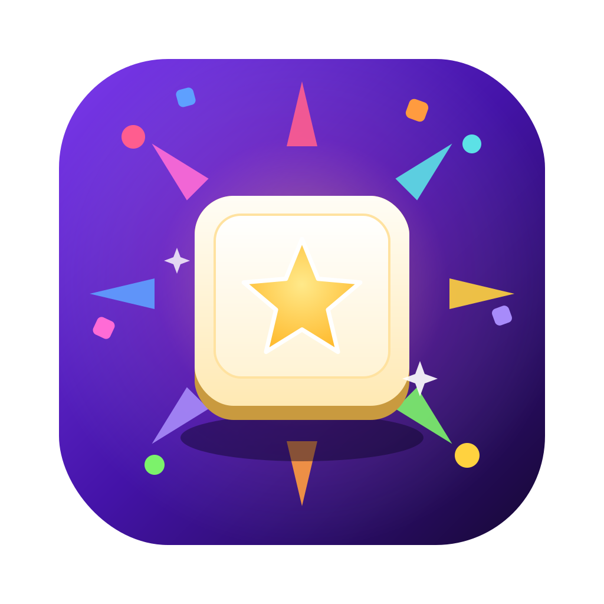

# KeyParty

**A key-smashing game for kids.**

Every key paints a different splash of color and plays a different sound.
While the game is running the keyboard is locked, so little hands can mash
away to their heart's content without quitting the game, opening other apps,
or changing anything on the computer.

 

[**▶ Play in your browser**](http://gkurt.com/KeyParty/)

&nbsp;

---

## Screenshots

<!--
Reserved for in-app images. Drop screenshots here once available —
for example the menu and a few colorful bursts mid-game:

  
  

-->

_Coming soon._

---

## How to play

Open KeyParty and press **Start**. The game fills the whole screen and the
keyboard locks, so the only thing that happens is the fun. Now smash any key,
or click and drag with the mouse:

- **Letters** — a glowing letter, a burst of color, and a musical note
- **Numbers** — a bouncing digit and a shower of stars
- **Space** — a rainbow firework, a big boom, and a little shake
- **Enter** — an expanding rainbow ripple and a happy chord
- **Arrows** — a shooting stream of triangles and a swoosh
- **Other keys** — Backspace, Tab, Escape, punctuation and the rest all get
  their own shapes and tones
- **Special keys** — Shift, Control, Option/Alt, Command/Windows and Caps Lock
  each get their own color, symbol, and chime, so nothing is ever a dud
- **Clicks & drags** — paint colored splashes and trails wherever you point.
  The cursor is a friendly glowing star you can always see.

## Leaving the game (grown-ups only)

There's no quit button while the game is running — that's on purpose. To get
back to the menu, hold down four keys at once:

> **Control + Option + Shift + Q**  (on Windows: **Control + Alt + Shift + Q**)

That returns you to the menu, where a grown-up can press **Quit** or start
playing again. Every other shortcut a child might stumble onto is caught by the
game and turned into more color and sound instead of doing anything to the
computer.

## A note for Mac users

The first time you play on a Mac, KeyParty asks for a one-time permission so it
can fully lock the keyboard. The menu has a **Grant Accessibility Access…**
button that takes you straight to the right setting — switch KeyParty on, come
back, and you're ready. You can start playing before granting it, too; the game
just locks a little less tightly until you do. (Windows needs no setup.)

## Links

- 🌐 **Website & browser version:** http://gkurt.com/KeyParty/
- ⬇️ **All downloads:** [Releases](https://github.com/KurtGokhan/KeyParty/releases/latest)

## License

KeyParty is open source under the [MIT License](LICENSE).

---

Want to build KeyParty yourself or help out?
See [DEVELOPMENT.md](DEVELOPMENT.md) and [CONTRIBUTING.md](CONTRIBUTING.md).

